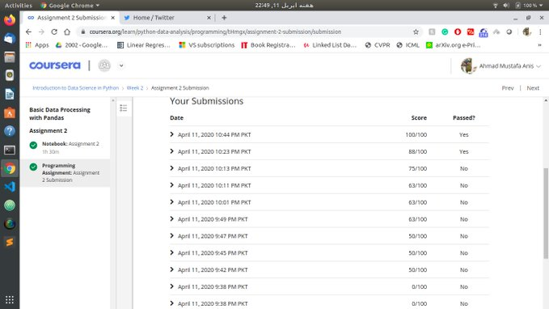

## DAY 1...
</img>

  [Day 1/ 100] #100daysofMLCode Finally managed to complete the 1st Programming Assignment of Applied Data Science with Python by @UMich at @coursera. It was a difficult(for me only) Pandas exercise but I managed to learn a lot. 

</img>

  Also I listned to some videos of Course 2 of Deep Learning Specilization by [deeplearning.ai](deeplearning.ai) at Coursera    where I learned about Normalization, Mini-Batch Gradient Descent, Stochastic Gradient Descent and Batch gradient descnet and when to use when.
  
</img>

Also read about half of Chapter 1 of Deep Learning wiht Python Book by Francois Chollet who is creater of Pandas. I learned about history of Deep Learning, some background of Machine Learning and some classical algorithms. I will be reading this book alongside my 100 Days of ML code journey as I am excited to learn about *Keras*.
