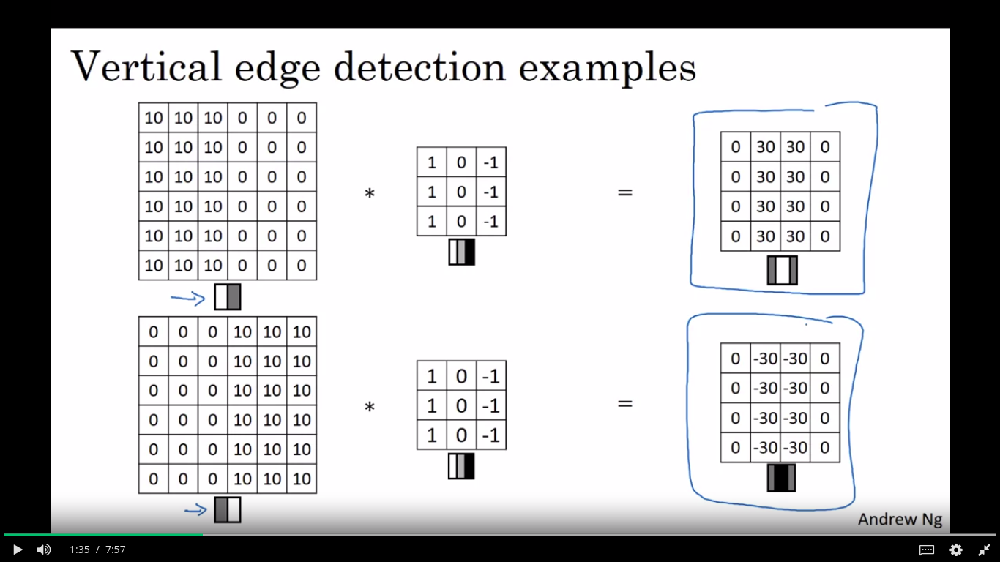

# Day 17 of #100DaysOfMLCode

----

</img>
 
Today I Started my Convolutional Neural Networks course at Coursera, which is builiding Block of Conv Neural Networks which are backbone of COmputer vision.
 
</img>
Learned about Vertical and Horizontal Edge Detection using Convolutional Operator which are building block of CNN

</img>