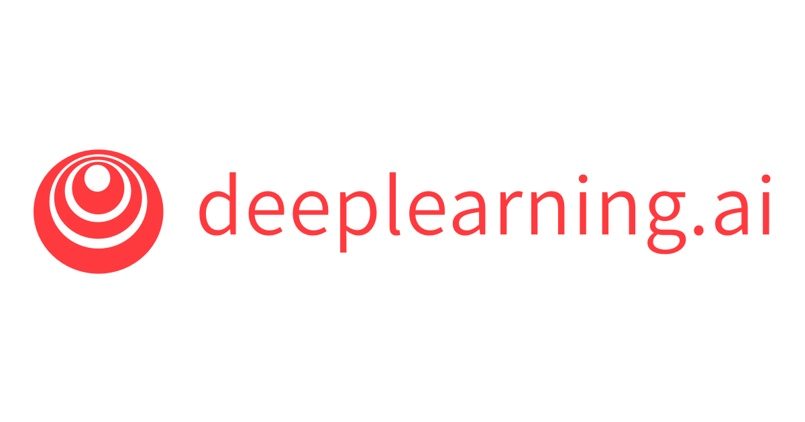
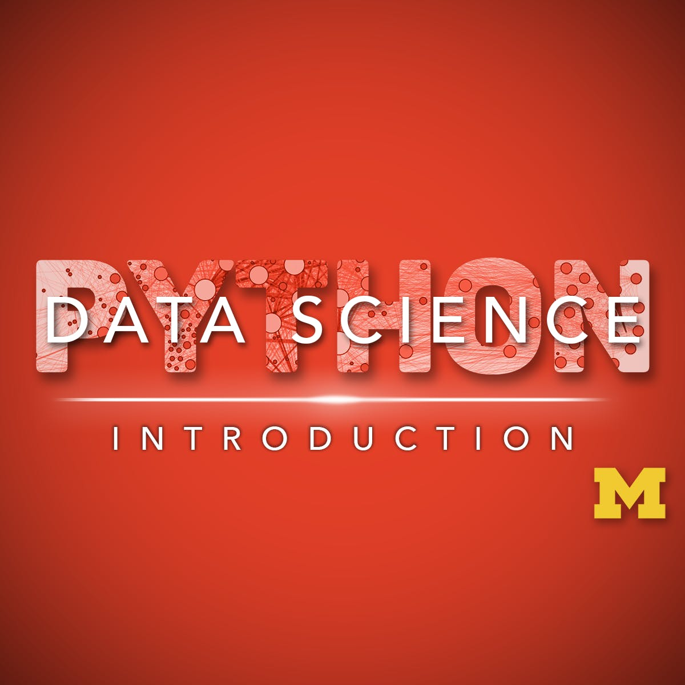

## Day 2 of #100DaysofMLCode

 [piaic.org]() </img>
### <u>PIAIC</u>
 Completed 1st online class(due to Covid-19) of PIAIC using ZOOM. Learned about basics of Numpy and it's importance(Which I already knew).

</img>
### <u>Deep Learning Specialization</u>
 Also watched some videos of Course 2 of Deep Learning Specialization by [deeplearning.ai]() at [coursera.org](), where I learned about Exponentially weighted averages, their importance and how they help in momentum gradient descent to speed up our optimization.

### <u>Deep Learning with Python Book by francois chollet </u>
 Completed Chapter # 1 of Deep Learning book by francois chollet who is creator Keras which I am eager to learn(havent started yet). I got very high level intuitions about some machine learning algorithms such as decision trees, random forests and gradient boosting machines. Also i learned about why deep learning is different, important and why it is getting famous now.

### <u>Applied Data Science with Python</u>
 Watched 1 video due to lack of time of Applied data science specialization by University of Michigan at Coursera. Here I learned about merging data frames in pandas. I am happy that I am learning pandas by doing it and one thing I like most about this specialization is that it's programming assignments are difficult so I learn by doing things.