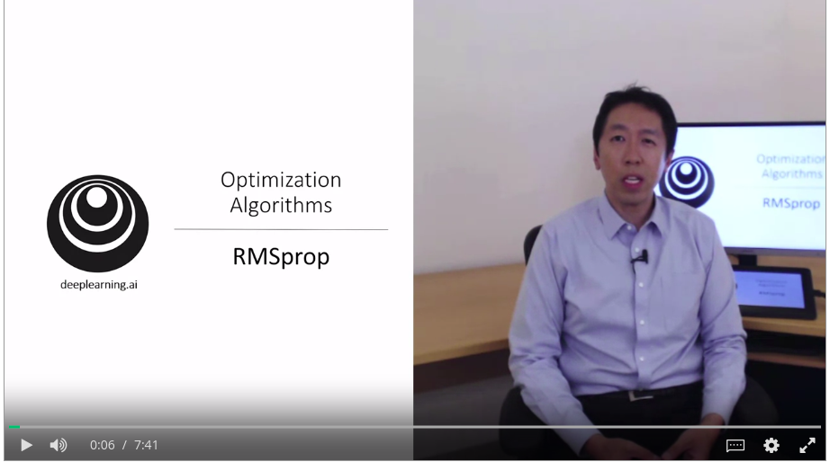
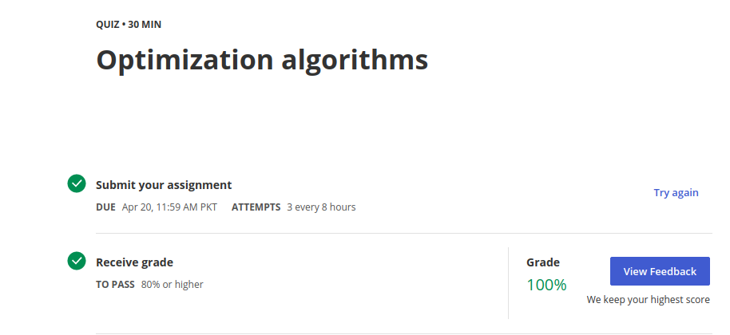
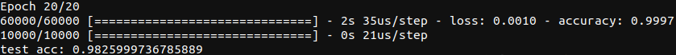

# Day 3 of #100DaysofMLCode

## Coursera work

## Deeplearning specialization by [deeplearning.ai]()
 </img>
#### Course 2 Week 2
##### **Today I revised Gradient Descent with Momentum and learned about RMSprop which is an optimzation algorithm faster then gradient descent. It decresaes horizontal learning of Gradient Descent and increases the vertical learning.**
----
##### **Then I learned about ADAM's Optimization Algorithm which combines Gradient Descent and RMSprop and faster up optimzation. Impressed by the technique used in it.**
----
##### **Next Topic I leanred about was <b>LEARNING RATE DECAY</b>. I had thought of this technique before but never thought of tips and techniques whihc people uses in industry and Professor Andrew told us.**
----
</img>
##### **Last thing from this course was quiz of this weeks content in which I scored 100% alhmadullilah. It was mainly related to these optimization algortihms, and other things we learned about.**
----
Completed Programming Assignment of Optimization algorithms where I learned about how to implement these tips and tricks in Python. Forgot to take screen shot and too lazy to load the page again 😞

----
----
## Deep Learning with Python book by Franicis
##### **I did not read a lot of book but some pages in whihc we make our first MNIST classifier using keras. This code was just to show how keras work. We will dive deep in keras later. Our classifier gave 98% accuarcy on test set. We used RMSprop although book has no clarification on code as they will explain it step by step later but I recognized it, thanks to Deeplearning Specialization by [deeplearning.ai]()**
</img>

----
----
##### Did not watched videos of Applied Data Science specialization at [coursera.org]() but instead revised topics of concat(),merge(), and join() in pandas with [real python](https://realpython.com/pandas-merge-join-and-concat/) and pandas official docs.
