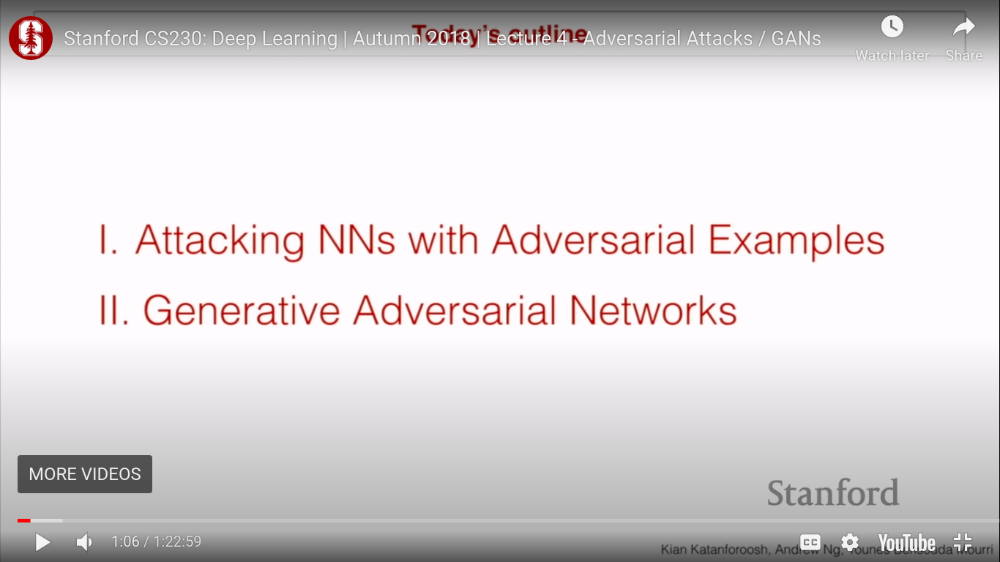
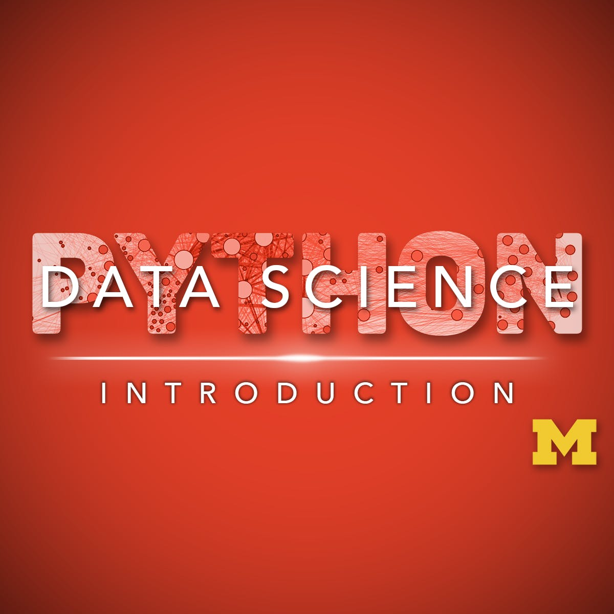

# Day 4 of #100DaysOfMLCode

## Today I Listned to Lecture 4 of CS230 as it stacks up with [deeplearning.ai]() specialization at coursera. Topics of todays lecture were 
## <b>CS230</b>
</img>
I completed about 60% of lecture. These were main topics which I learned about.

My mind was blown when I learned the simple technique which is used to creat an adversial image.

## <b>Deep Learning with Python</b>
Today I leanred about different shapes of tensors commonly used in practise i.e for an image data set, we use 4d tensor (number of eg, hegight, width, color scale) etc.
This book is very interesting and i hope to complete it soon.

</img>
## <b>Applied Data Science with Python</b>
ALthough it is not good to say but i am dissapinted with this specilization and I am not learning alot. THings are going above my head so I will not focous on data cleaninsing part right now as I will learn it later in [piaic.org](). So i am enrolling my self in another Machine LEanring specilization which seems better in rating and reviews. Thanks to IIUI for free coursera courses. I hope to complete 1st course of speiclization soon and then I will focous on Machine LEanring courses completely.
