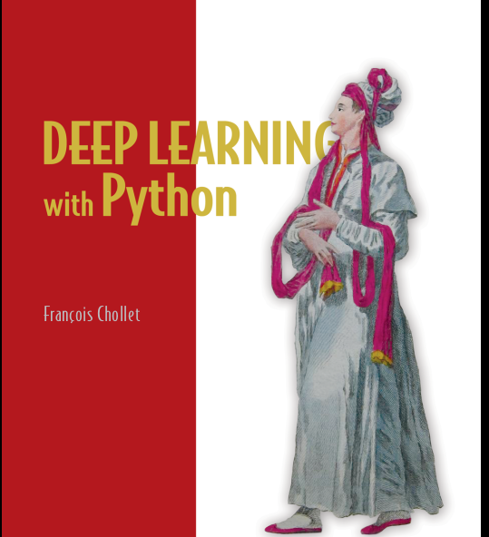

# Day 5 of #100DaysOfMLCode
-----
</img>
## Today I was feeling low so only read the Deep Learning with Python by Francois Chollet. I learned about Deep Learning work flow, importance of Keras, Little bit Maths behind Deep LEarning, and reworked the MNIST example by understanding the code behind it. Keras is wonderful framework and I am lovin it. I have tried Pytorch before but I think my instructor was not good so I did not enjoyed it. In future I plan to go in pytorch as most researchers now a days use pytorch.
----
## I also Enroleed in Applied Machine Leanring program at [coursera.org]() after leaving Applied Data Science program and this program is pretty entertaining, instructors are good. 