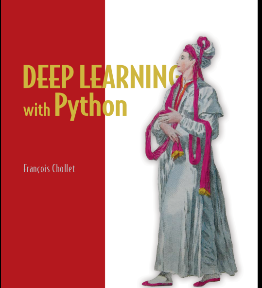

# Day 6 of #100DaysOfMLCode

</img>
Today I learned about Hyper Parameters tuning, Batch Normalization and thier techniques in COurse 2 of Deep LEarning Specialization by [deeplearning.ai]() at [coursera.org]().

</img>
I covered 2 modules of Chapter 3 of this book where I Learned about basics of neural networks in Keras and workflow of keras. I am in love with keras and it being easy to use.

----------

Also I enrolled in Applied Machine Leanring Specialization at [coursera.org]() where I am learning basics of Machine Leanring. SO far so good.