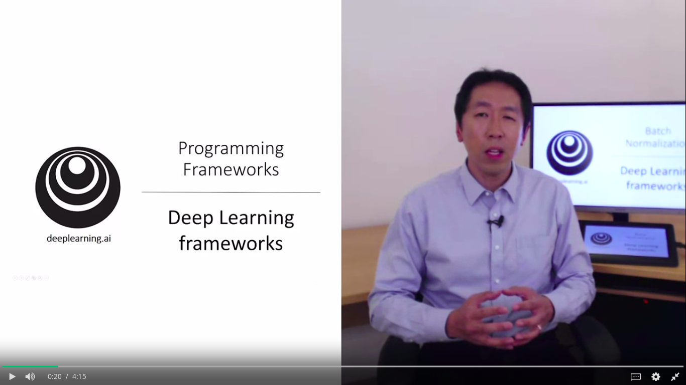

# Day 8 of #100DaysOfMLCode

</img>
##### Today I learned about Deep Learning frameworks, why are they imp and how to choose 1.
</img>
##### I also wrote my first tensorflow program and setup tensorflow enviorment on my local machine which wasted alot of my time.

</img>
##### Today I completed my Movie Classification project based on IMDB reviews using Keras. I covered the overfitting part where we reduced the overfitting by reducing the number of epochs.