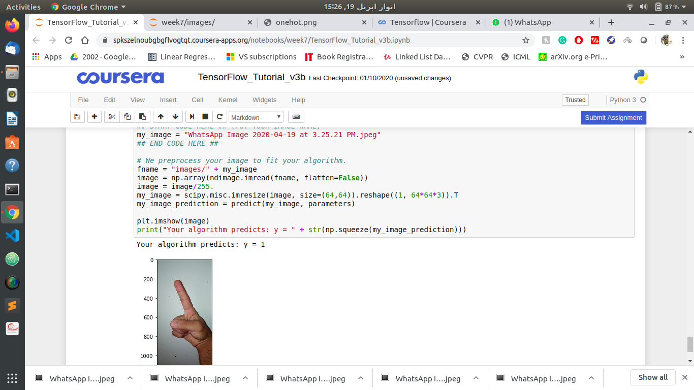

# Day 9 of #100DaysOfMLCode

</img>

Today I Completed my Tensorflow assignment where we have to estimate the number of fingers showing in a picture. It was a fun assignment and I learned a lot about TensorFlow.
</img>

Course 3 of this Assignment is all about Structuring Machine Learning Projects.

----
</img>

</img>

I did not learned about Keras today but focoused on Course 2 of Machine Learning algorithms in real world where I learned and coded about Decsion Trees and Random Forests using Sci kit learn

