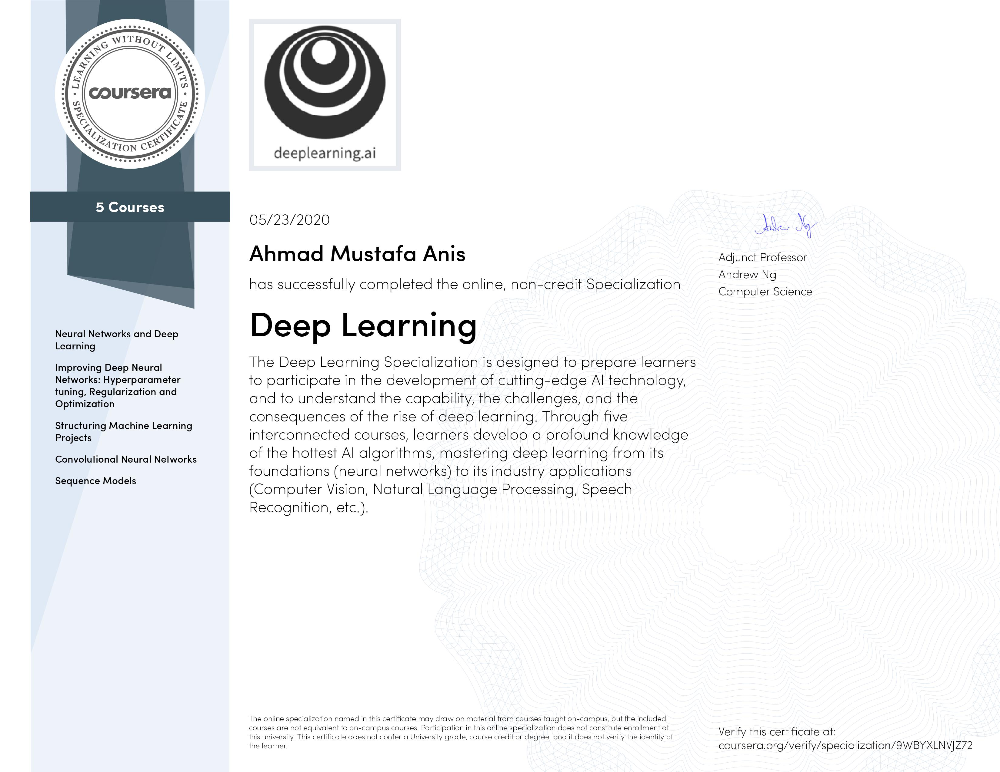

# 100-Days-of-ML-Code
This Repo contains all my work done during 100 days of ML code challenge. Also check my Twitter where I update progress daily @AhmadMustafaAn1

## Courses so Far in Challenge.
- <b>Deep Learning Specialization</b>
</img>
- <b> Introduction to Data Science with Python
- </img>
- <b> Introduction to Applied Machine Learning 
- 

---
### I am making folders for each Day where you can check my daily progress.
If you are new to AI, follow this path [Machine Learning Path](https://github.com/ahmadmustafaanis/Machine-Learning-Path)

### Once I complete This, I will public seperate repos for each course work I have completed in these 100 days.sad
